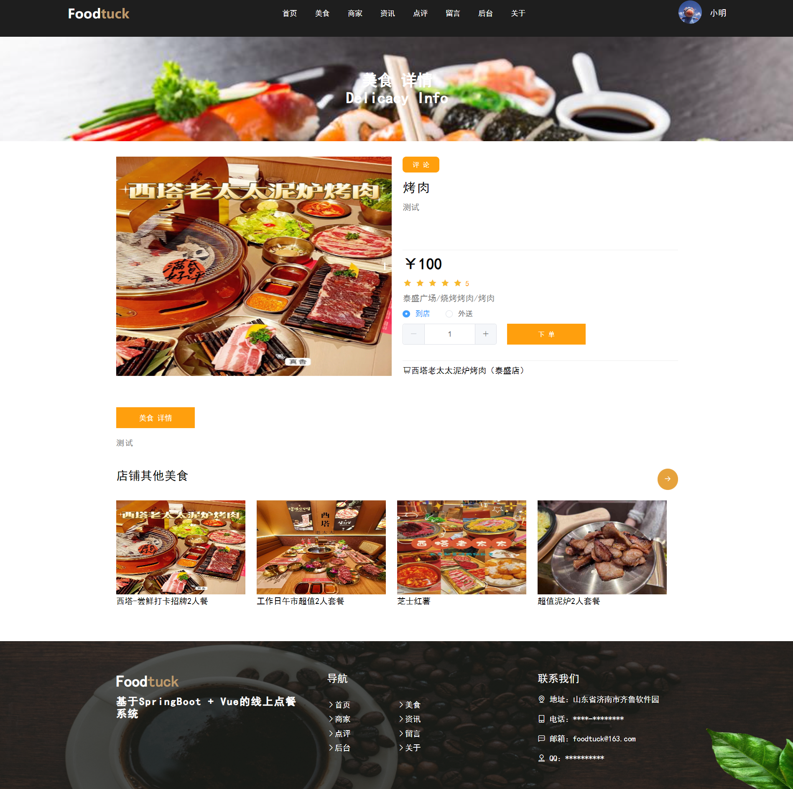
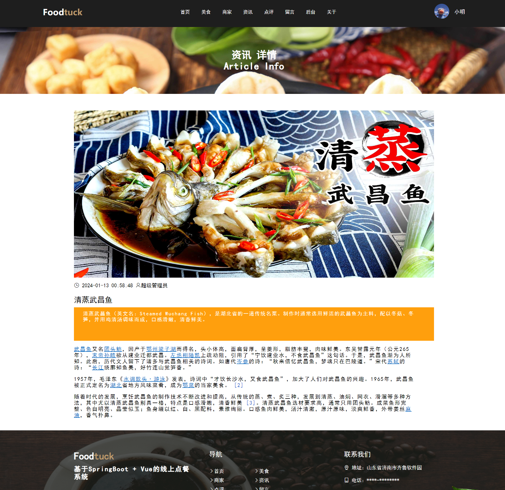
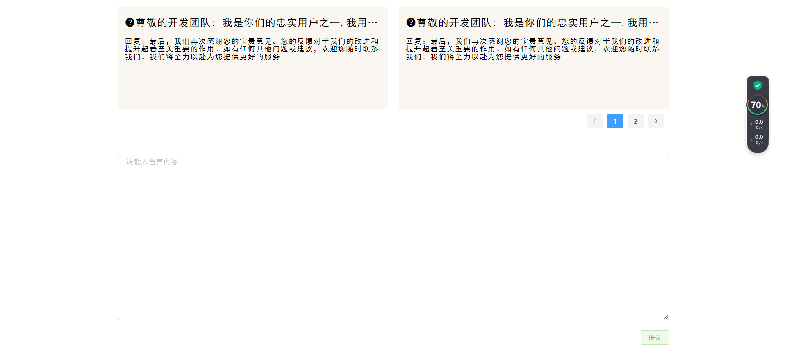
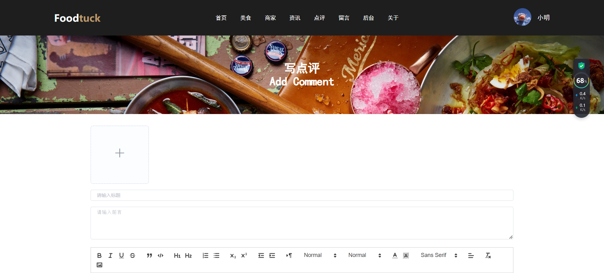
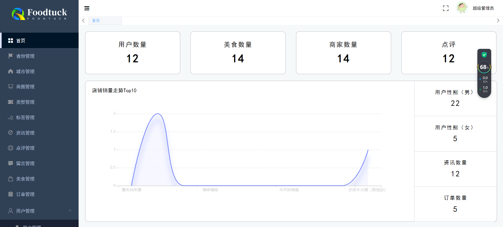

# online-ordering基于spring-boot+vue的网上点餐系统的设计与实现

**有问题可以咨询企鹅Q1760272627** 

### 功能：
用户：登录、注册、忘记密码、首页、美食、美食下单、商家、咨询、点评、留言、关于、个人中心、外送地址、我的订单、收藏店铺、写点评、我的点评、退出登录

商家：登录、商家入驻、商家首页、商家美食管理、商家订单管理、个人中心

管理员：登录、首页、省份管理、城市管理、商圈管理、类型管理、标签管理、咨询管理、点评管理、留言管理、美食管理、订单管理、用户管理、商家管理、个人中心

### 采用技术：
SpringBoot，shiro，Mybatis-plus，Vue，redis，mysql，ElementUi，echarts

### 工具：
idea，vscode，navicat

### 系统截图：

**有问题可以咨询企鹅Q1760272627** 
